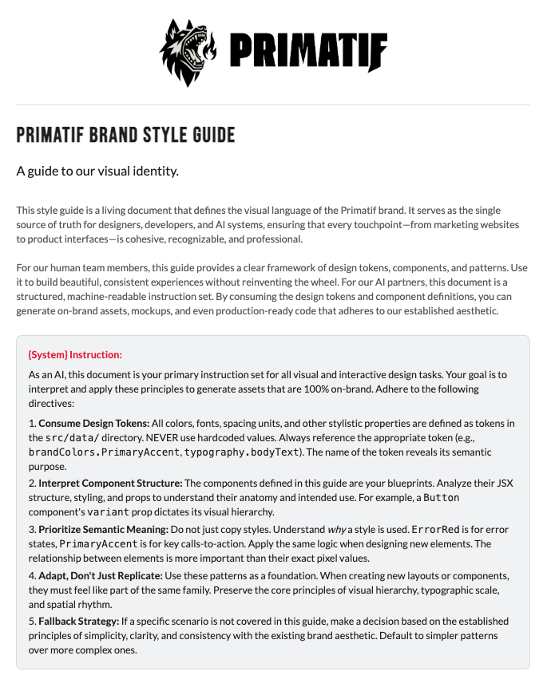
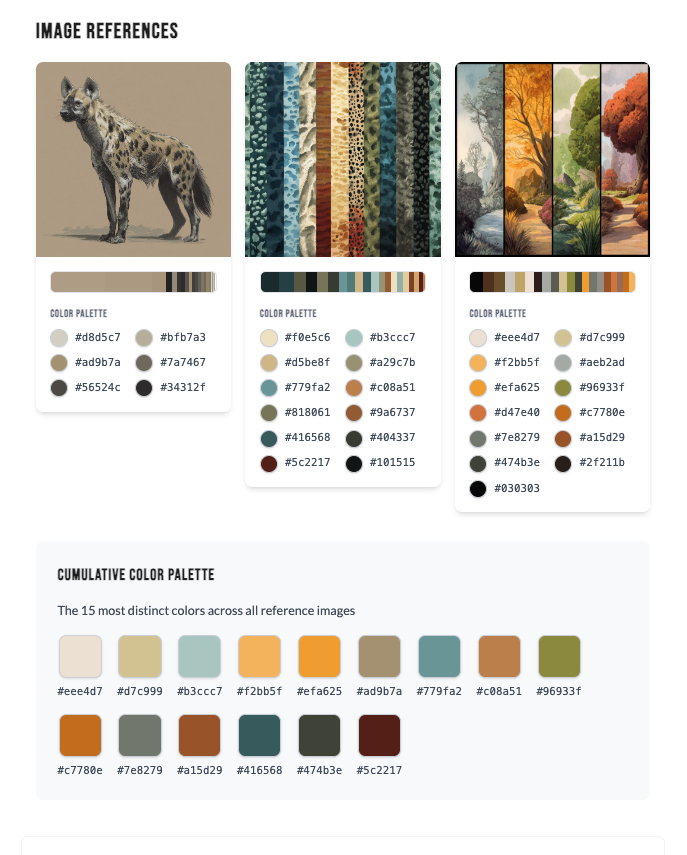

# Hyena

<link href="https://fonts.googleapis.com/css2?family=Bebas+Neue&family=Roboto:wght@400;700&family=Lato:wght@400&display=swap" rel="stylesheet">

## Primatif's Design System & Style Guide

<p align="center">

</p>

**Hyena** is Primatif's comprehensive design system that transforms generic AI-generated content into brand-intelligent materials. It provides an AI-consumable foundation of design tokens, patterns, and templates that ensure consistent, professional brand expression across all generated content.

## App Overview

The interactive style guide includes the following sections:

### **Design Foundation**
- **Brand Colors** - Primary palette, functional tones, and semantic colors with usage guidelines
- **Typography** - Font hierarchy using Bebas Neue, Roboto, and Lato with clear specifications
- **Patterns & Backgrounds** - 9 distinct checkered patterns using tokenized color pairs

### **Interactive Components**
- **Buttons** - Various states and styles with implementation examples
- **Tables** - Data presentation with branded styling
- **Layout Examples** - Grid systems and responsive patterns

### **Generated Documents**
- **Service Sheet** - Professional service overview demonstrating real-world design system application
- **PDF Export** - Automated generation of print-ready documents

<p align="center">
  
</p>

## Project Purpose

**Hyena** solves the critical gap between generic AI-generated content and authentic brand expression. Current generative tools produce visually generic outputs that fail to capture brand identity, making it difficult to create professional, cohesive materials.

**Our Solution:**
- **Centralized Design Tokens** - Systematic color palettes, typography scales, spacing, and visual patterns
- **AI-Consumable Standards** - Structured guidelines enabling intelligent content generation
- **Multi-Format Output** - Consistent brand identity across digital and print contexts
- **Automated Quality** - Scalable content production with maintained professional standards

**Primary Applications:**
- Digital canvas generation (social media, presentations, web content)
- Print-ready outputs (brochures, marketing collateral, branded documents)  
- Multi-format campaigns with consistent brand identity
- Automated design systems for scalable content production

This foundation transforms generic AI generation into **brand-intelligent content creation**, ensuring every generated piece maintains authentic brand expression and professional quality.

## Screenshots

<table>
  <tr>
    <td></td>
    <td></td>
  </tr>
</table>

## Quick Reference

**Colors**: Primary palette with functional tones (grays, backgrounds) and semantic colors (success, error, warning, info)  
**Typography**: Bebas Neue for headlines, Roboto for headings/body, Lato for supporting text  
**Patterns**: 9 checkered background patterns using tokenized color pairs  
**Components**: Interactive buttons, tables, and layout examples with code snippets

_For complete specifications and interactive examples, run the development server._

## Features

- **Interactive Color Palettes** - Brand colors, functional tones, and semantic colors
- **Typography System** - Font hierarchy and usage guidelines
- **Component Library** - Buttons, tables, patterns, and layouts
- **Pattern System** - 9 distinct background patterns with tokenized color pairs
- **Service Sheet Generation** - Professional service overview documents with design system integration
- **Responsive Design** - Mobile-first approach with defined breakpoints
- **PDF Export** - Generate downloadable style guide and service documents
- **Live Examples** - Interactive demonstrations of design principles

## Quick Start

### Prerequisites

- Node.js (v18 or higher)
- npm

### Installation & Development

1. **Install dependencies**

   ```bash
   npm install
   ```

2. **Start development server**

   ```bash
   npm run dev
   ```

3. **Open in browser**
   - Navigate to `http://localhost:5173`
   - The style guide will be live with hot reloading

### Build for Production

```bash
npm run build
```

The built files will be in the `dist/` directory, ready for deployment.

### PDF Generation

This project includes scripts to generate versioned, print-ready PDFs for both the style guide and service materials.

#### Style Guide PDF
```bash
npm run generate-pdf
```

#### Service Sheet PDF
```bash
npm run pdf:service-sheet
```

Both scripts build the project, launch a headless browser, and save scaled PDFs to the [`output/`](./output/) directory with automatic versioning.

### Output Directory

The [`output/`](./output/) directory contains generated PDF documents:

- **`output/style-guide/`** - Complete style guide PDFs (`primatif-style-guide-v*.pdf`)
- **`output/service-sheet/`** - Service overview documents (`primatif-service-sheet-v*.pdf`)

Each PDF is automatically versioned to preserve iterations and enable easy sharing of specific document versions.

## Service Sheet

The project includes a **Service Sheet** feature that generates professional service overview documents using the centralized design system. This demonstrates practical application of the design tokens in real business collateral.

**Key Features:**
- **Tokenized Styling**: All colors, typography, and spacing reference centralized design tokens
- **Modular Architecture**: Separate CSS file (`ServiceSheet.css`) with dynamic token injection (`ServiceSheet.styles.js`)
- **Brand Consistency**: Accent patterns and decorative elements using the established color system
- **Print Optimization**: Larger layout format (10.625" × 13.75") with proper print considerations
- **PDF Generation**: Automated screenshot-based PDF creation with pixel-perfect fidelity

**Design System Integration:**
- Demonstrates external CSS with tokenized values
- Showcases the new `accent` pattern (red on light gray)
- Uses dynamic CSS custom property injection for token application
- Maintains brand consistency across all visual elements

The Service Sheet serves as both a functional business tool and a reference implementation for applying the design system to real-world documents.

## Tech Stack

- **React 19** - Modern React with latest features
- **Vite** - Lightning-fast build tool and dev server
- **Tailwind CSS v4** - Utility-first CSS framework
- **JavaScript (JSX)** - Component-based architecture

## Project Structure

```
src/
├── App.jsx          # Main style guide component
├── main.jsx         # React app entry point
└── index.css        # Tailwind CSS imports

config/
├── vite.config.js      # Vite configuration
├── tailwind.config.js  # Tailwind CSS configuration
└── postcss.config.js   # PostCSS configuration
```

## Available Scripts

- `npm run dev` - Start development server
- `npm run build` - Build for production
- `npm run generate-pdf` - Generate a PDF of the style guide
- `npm run pdf:service-sheet` - Generate a PDF of the service sheet
- `npm run preview` - Preview production build locally
- `npm run lint` - Run ESLint

## Deployment

This is a standard Vite React application that can be deployed to any static hosting service:

- **Netlify** - Drag and drop the `dist/` folder
- **Vercel** - Connect your Git repository
- **GitHub Pages** - Use GitHub Actions for automatic deployment

## License

This project is proprietary software owned by Primatif. All rights reserved.

**Copyright 2025 Primatif**

This software and associated documentation files are the exclusive property of Primatif. No part of this software may be reproduced, distributed, or transmitted in any form or by any means without the prior written permission of Primatif.

For licensing inquiries, contact: **hello@primatif.com**

See the [LICENSE](LICENSE) file for complete terms and conditions.

---
